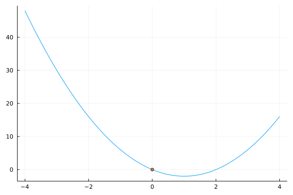
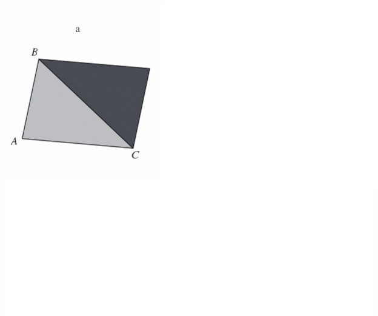
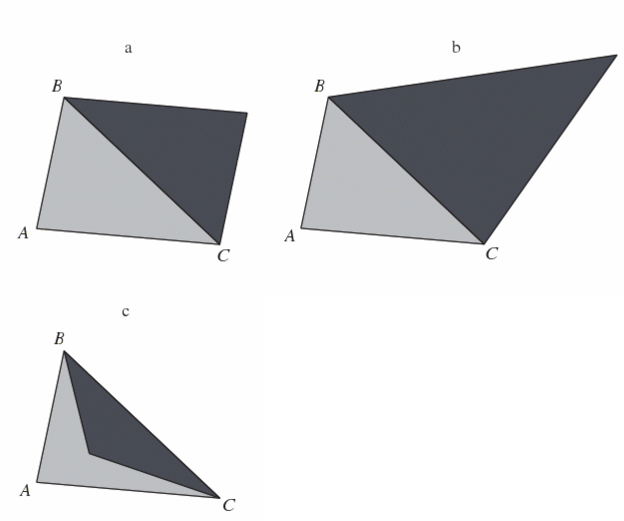
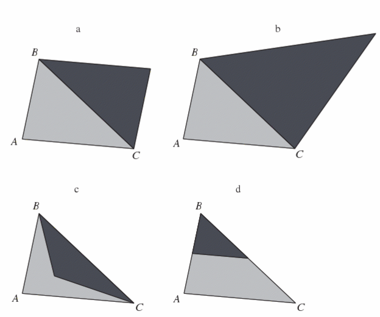
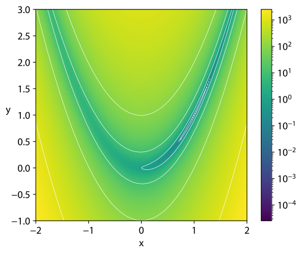
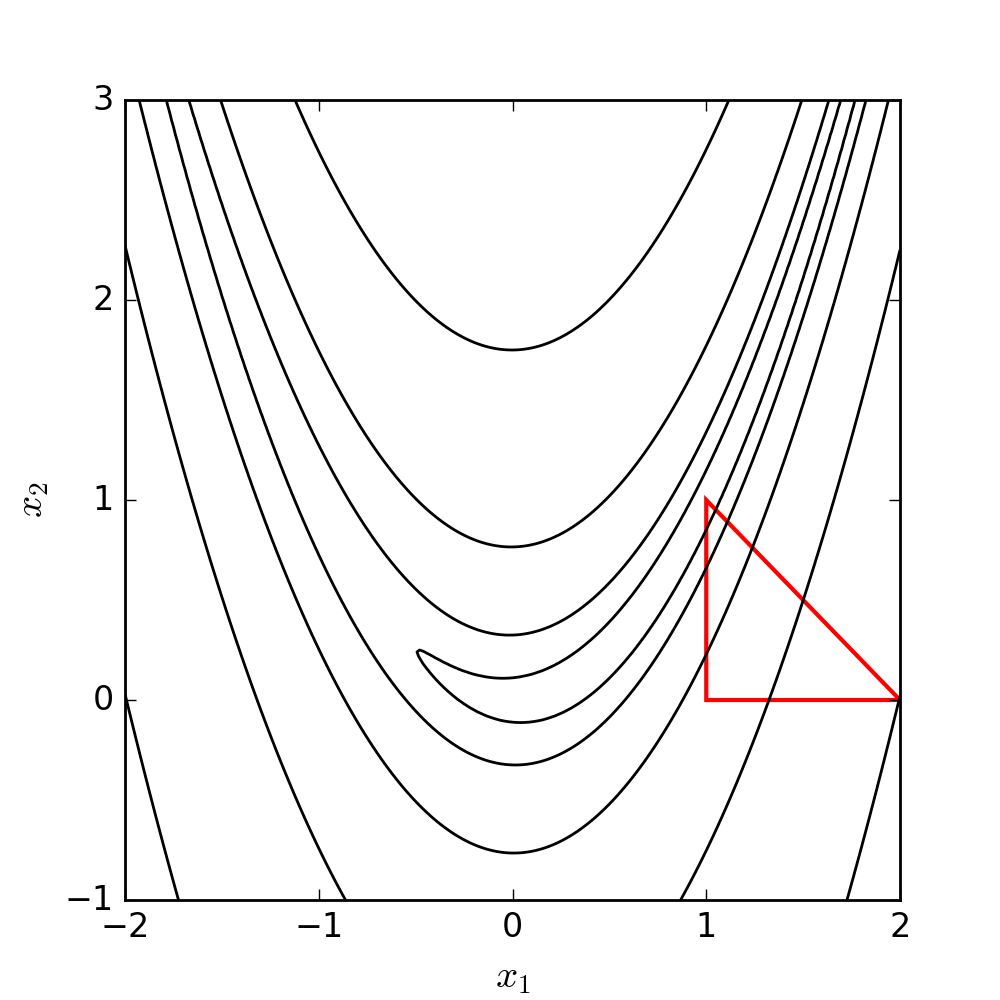

## Course Roadmap {background-color="orange"}

1.  [Introduction to Scientific Computing]{.gray}
2.  [Fundamentals of numerical methods]{.gray}
3.  [Systems of equations]{.gray}
4.  Optimization
    1.  **Unconstrained optimization: intro**
    2.  Unconstrained optimization: line search and trust region methods
    3.  Constrained optimization: theory and methods
    4.  Constrained optimization: modeling framework
5.  Function approximation
6.  Structural estimation

## Agenda {background-color="orange"}

-   Today we begin exploring one of the most important methods in numerical methods: optimization
-   We start with an introduction and general aspects of numerical optimization
-   Then, we will cover basic derivative-free optimization algorithms

## Main references for today {background-color="orange"}

-   Miranda & Fackler (2002), Ch. 4
-   Judd (1998), Ch. 4
-   Nocedal & Writght (2006), Ch. 2
-   A.K. Dixit (1990), *Optimization in Economic Theory*   
-   Lecture notes from Ivan Rudik (Cornell) and Florian Oswald (SciencesPo)

## Optimization problems

Optimization problems are ubiquitous in economics. Examples?

. . .

-   Agent behavior
    -   Consumer utility maximization
    -   Firm profit maximization

. . .

-   Social planner maximizing welfare

. . .

-   Econometrics
    -   Minimization of squared errors (OLS)
    -   Minimization of empirical moment functions (GMM)
    -   Maximization of likelihood (MLE)

. . .

In this unit, we will review the fundamentals of optimization and cover the main algorithms in numerical optimization

# Fundamentals of unconstrained optimization

## Optimization setup

We want to minimize an objective function $f(x)$

$$\min_x f(x)$$

where $x \in \mathbb{R}^n$ is a real vector with $n \ge 1$ components and $f : \mathbb{R}^n \rightarrow \mathbb{R}$ is smooth

-   In unconstrained optimization, we impose no restrictions on $x$

## Optimization setup

We will focus on *minimization* problems

-   That's because the optimization literature and programming packages usually frame optimization as minimization

But it's simple to convert minimization into maximization problem. How?

. . .

-   Flip the sign of $f(x)$!

$$
\min_x f(x) \Leftrightarrow \max_x g(x)
$$

where $g(x) = -f(x)$

## Optimization solutions: global vs. local optima

A point $x^*$ is a **global minimizer (or optimum)** of $f$ if

$$ f(x^*) \le f(x) \;\; \forall x \in \mathbb{R}^n$$

Since we can't evaluate the function at infinite points, finding global optima is generally a difficult problem

-   We can't be sure if the function suddenly rises between two points we evaluate
-   Most algorithms can only find **local optima**

## Optimization solutions: global vs. local optima

A point $x^*$ is a **local minimizer (or optimum)** of $f$ if there is a neighborhood $\mathcal{N}$ of $x^*$ such that

$$ f(x^*) \le f(x) \;\; \forall x \in \mathcal{N}$$

-   A neighborhood of $x^*$ is an open set that contains $x^*$

. . .

We call $x^*$ a **strict local minimizer** if $f(x^*) < f(x) \;\; \forall x \in \mathcal{N}$

## Identifying local optima

A first approach to checking whether a point is a local optimum is to evaluate the function at all points around it

But if $f$ is *smooth*, calculus makes it much easier, especially if $f$ is twice continuously differentiable

-   We only need to evaluate the *gradient* $\nabla f(x^*)$ (first derivative) and the *Hessian* $\nabla^2 f(x^*)$ (second derivative)

There are four key theorems to help us[^1]

[^1]: See proofs in Nocedal & Wright (2006), chapter 2

## Identifying local optima

**Theorem 1: First-Order Necessary Conditions**

> If $x^*$ is a local minimizer and $f$ is continuously differentiable in an open neighborhood of $x^*$, then $\nabla f(x^*) = 0$

. . .

-   If $n = 1$, this means that $f^{\prime}(x^*) = 0$

. . .

Note that this is only a **necessary** condition

So, we can look for points where the first derivative is zero (with rootfinding)

But, once we find them, we can't be sure yet if these points indeed are local minimizers

## Identifying local optima

**Theorem 2: Second-Order Necessary Conditions**

> If $x^*$ is a local minimizer of $f$ and $\nabla^2 f$ exists and is continuously differentiable in an open neighborhood of $x^*$, then $\nabla f(x^*) = 0$ and $\nabla^2 f(x^*)$ is positive semidefinite

. . .

-   If $n = 1$, this means that $f^{\prime \prime}(x^*) \geq 0$, i.e., the function is locally convex
    -   Positive semidefiniteness is the multidimensional analogous of convexity in 1D
    -   A matrix $B$ is positive semidefinite if $p^\prime B p \geq 0$ for all $p$

. . .

-   For maximization problems, we check whether $\nabla^2 f(x^*)$ is negative semidefinite

## Identifying local optima

**Theorem 3: Second-Order Sufficient Conditions**

> Suppose $\nabla^2 f$ is continuous in an open neighborhood of $x^*$ and that $\nabla f(x^*) = 0$ and $\nabla^2 f$ is positive definite. Then $x^*$ is a strict local minimizer of $f$

. . .

-   Note that these are *sufficient* conditions, not necessary conditions
    -   For example, $f(x) = x^4$ has a local minimizer at $x^* = 0$. But this point does not satisfy the 2nd-order sufficient conditions

## Conditions for global optima

Another theorem can help us characterize global optima

**Theorem 4: Second-Order Sufficient Conditions for Global Optima**

> When $f$ is convex, any local maximizer $x^*$ is a global minimizer of $f$. If in addition $f$ is differentiable, then any point $x^*$ at which $\nabla f(x^*) = 0$ is a global minimizer of $f$

-   If the function is globally convex, any local minimizer we find is also a global minimizer

# Optimization algorithms

## Optimization algorithms

Optimization problems have many similarities to problems we've already seen in the course

-   FOCs of an unconstrained optimization problem are similar to a rootfinding problem
-   FOCs of a constrained optimization problem are similar to a complementarity problem

## Optimization algorithms

We typically want to find a global optimum of our objective function $f$

Typically, analytic problems are set up to have a unique minimum so any local solver can generally find the global optimum

-   But many problems in Economics don't satisfy the typical sufficiency conditions for a unique minimum (strictly decreasing and convex), such as
    -   Games with multiple equilibria
    -   Concave state transitions
    -   Certain types of estimation procedures

## Optimization algorithms

We make two initial distinctions between **solvers** (i.e., optimization algorithms):

-   **Local vs global:** are we finding an optimum in a local region, or globally?
    -   Most solvers search local optima

. . .

-   **Derivative-using vs derivative-free:** do we want to use higher-order information?

. . .

In this course, we'll focus on local solvers

-   Global solvers are usually stochastic or subdivide the search space and apply local solvers
-   Common global solvers: genetic algorithms, simulated annealing, DIRECT, and Sto-go

## Optimization algorithms

How do we find a local minimum?

Do we need to evaluate every single point?

. . .

Optimization algorithms typically have the following set up:

1.  Start at some $x_0$
2.  Work through a series of iterates $\{x^{(k)}\}_{k=1}^\infty$ until it "converges" with sufficient accuracy

. . .

If the function is smooth, we can take advantage of that information about the function's shape to figure out which direction to move in next

## Solution strategies: line search vs. trust region

When we move from $x^{(k)}$ to the next iteration, $x^{(k+1)}$, we have to decide

-   Which direction from $x^{(k)}$
-   How far to go from $x^{(k)}$

. . .

There are two fundamental solution strategies that differ in the order of those decisions

-   **Line search** methods first choose a *direction* and then select the optimal *step size*

. . .

-   **Trust region** methods first choose a *step size* and then select the optimal *direction*

. . .

We'll see the details of each strategy later. Let's start with two relatively simple, derivative-free methods

## Derivative-free optimization: golden search

Similar to bisection, **golden search** looks for a solution of a one-dimensional problem over smaller and smaller brackets

. . .

We have a continuous one dimensional function, $f(x)$, and we want to find a local minimum in some interval $[a,b]$

## Derivative-free optimization: golden search

1.  Select points $x_1,x_2 \in [a,b]$ where $x_2 > x_1$
2.  Compare $f(x_1)$ and $f(x_2)$

-   If $f(x_1) < f(x_2)$, replace $[a,b]$ with $[a,x_2]$
-   Else, replace $[a,b]$ with $[x_1,b]$

3.  Repeat until a convergence criterion is met

. . .

Replace the endpoint of the interval next to the evaluated point with the highest value

$\rightarrow$ keep the lower evaluated point in the interval

$\rightarrow$ guarantees that a local minimum still exists

## Derivative-free optimization: golden search

How do we pick $x_1$ and $x_2$?

. . .

Achievable goal for selection process: 

- New interval is independent of whether the upper or lower bound is replaced 
- Only requires one function evaluation per iteration

. . .

There's one algorithm that satisfies this

## Derivative-free optimization: golden search

Golden search algorithm for point selection:

$$
\begin{gather}
    x_i = a + \alpha_i (b-a) \notag \\
    \alpha_1 = \frac{3-\sqrt{5}}{2}, \qquad \alpha_2 = \frac{\sqrt{5} - 1}{2}
\end{gather}
$$

. . .

The value of $\alpha_2$ is called the golden ratio, from where the algorithm gets its name

## Golden search in practice

Let's write a function to perform the golden search algorithm `golden_search(f, lower_bound, upper_bound)`, then use it to find the minimizer of $f(x) = 2x^2 - 4x$ between -4 and 4.

Steps:

1.  Calculate points $x_1,x_2 \in [a,b]$

-   $x_1 = a + \frac{3-\sqrt{5}}{2} (b-a)$ and $x_2 = a + \frac{\sqrt{5} - 1}{2} (b-a)$

2.  Compare $f(x_1)$ and $f(x_2)$

-   If $f(x_1) < f(x_2)$, replace $[a,b]$ with $[a,x_2]$
-   Else, replace $[a,b]$ with $[x_1,b]$

3.  Repeat until a convergence criterion is met

## Golden search in Julia

```{julia}
function golden_search(f, lower_bound, upper_bound)
    alpha_1 = (3 - sqrt(5))/2  # GS parameter 1
    alpha_2 = (sqrt(5) - 1)/2  # GS parameter 2
    tolerance = 1e-2           # tolerance for convergence
    difference = 1e10
    while difference > tolerance
        x_1 = lower_bound + alpha_1*(upper_bound - lower_bound)  # new x_1
        x_2 = lower_bound + alpha_2*(upper_bound - lower_bound)  # new x_2
        if f(x_1) < f(x_2)  # update bounds
            upper_bound = x_2
        else
            lower_bound = x_1
        end
        difference = x_2 - x_1
    end
    println("Minimum is at x = $((lower_bound+upper_bound)/2).")
end;
```

## Golden search in Julia

```{julia}
f(x) = 2x^2 - 4x;
golden_search(f, -4, 4)
```

## Golden search in Julia

{fig-align="center"}

## Derivative-free optimization: Nelder-Mead

Golden search is nice and simple but only works in one dimension

There are several derivative free methods for minimization that work in multiple dimensions. The most commonly used one is the **Nelder-Mead** (NM) algorithm

. . .

NM works by first constructing a simplex: we evaluate the function at $n+1$ points in an $n$ dimensional problem

It then manipulates the highest value point, similar to golden search

## Derivative-free optimization: Nelder-Mead

There are six operations:

. . .

-   **Order:** order the value at the vertices of the simplex $f(x_1)\leq \dots \leq f(x_{n+1})$

. . .

-   **Centroid:** calculate $x_0$, the centroid of the non - $x_{n+1}$ points

## Derivative-free optimization: Nelder-Mead

::: columns
::: column
(a) **Reflection**: reflect $x_{n+1}$ through the opposite face of the simplex and evaluate the new point: $x_r = x_0 + \alpha(x_0 - x_{n+1})$, $\alpha > 0$

-   If this improves upon the second-highest but is not the lowest value point, replace $x_{n+1}$ with $x_r$ and restart
-   If this is the lowest value point so far, **expand**
-   If $f(x_r) > f(x_n)$, **contract**
:::

::: column

:::
:::

## Derivative-free optimization: Nelder-Mead

::: columns
::: column
(b) **Expansion:** push the reflected point further in the same direction

(c) **Contraction:** Contract the highest value point toward the middle

-   Compute $x_c = x_0 + \gamma(x_0 - x_{n+1})$, $0 < \gamma \leq 0.5$
-   If $x_c$ is better than the worst point, replace $x_{n+1}$ with $x_c$ and restart
-   Else, **shrink**
:::

::: column

:::
:::

## Derivative-free optimization: Nelder-Mead

::: columns
::: column
(d) **Shrinkage:** shrink the simplex toward the best point

-   Replace all points but the best one with $x_i = x_1 + \sigma(x_i - x_1)$
:::

::: column

:::
:::

## Nelder-Mead illustration

::: columns
::: column
Let's see NM in action minimizing a classic function in the optimization literature: the *Rosenbrock (or banana) function*

$$
f(x, y) = (a - x)^2  + b(y - x^2)^2
$$

Its global minimizer is $(x, y) = (a, a^2 )$
:::

::: column
*a = 1, b = 100*


:::
:::

## Nelder-Mead illustration

{fig-align="center"}

## Nelder-Mead in Julia

Nelder-Mead is a pain to code efficiently: don't spend the time doing it yourself!

For unconstrained optimization, Julia's most mature package is `Optim.jl`, which includes NM

. . .

```{julia}
using Optim;
# Define Rosenbrock function with a = 1, b = 100
f(x) = (1.0 - x[1])^2 + 100.0 * (x[2] - x[1]^2)^2; 

x0 = [0.0, 0.0]; # initial guess
```

## Nelder-Mead in Julia

```{julia}
soln = Optim.optimize(f, x0, NelderMead())
```

## Nelder-Mead in Julia

We can check the solution and the minimum value attained using

```{julia}
soln.minimizer
```

```{julia}
soln.minimum
```

## Nelder-Mead in Julia

If you want to check the steps, run `Optim.optimize` with option `store_trace = true`

```{julia}
soln = Optim.optimize(f, x0, NelderMead(), Optim.Options(store_trace=true));
Optim.trace(soln)
```

## Final comments on Nelder-Mead

-   Nelder-Mead is commonly used in optimization packages but it's slow and unreliable
    -   It has no real useful convergence properties
-   Only use Nelder-Mead if you're solving a problem with derivatives that are costly to calculate or approximate