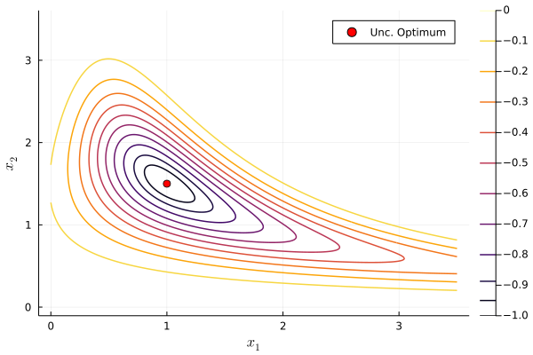
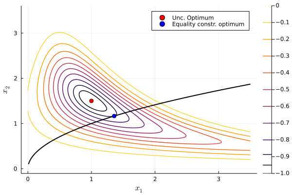
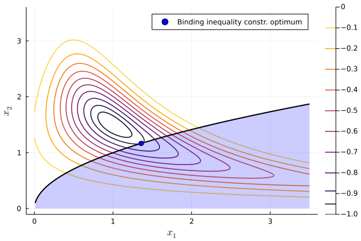
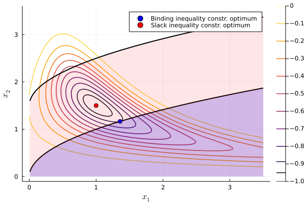
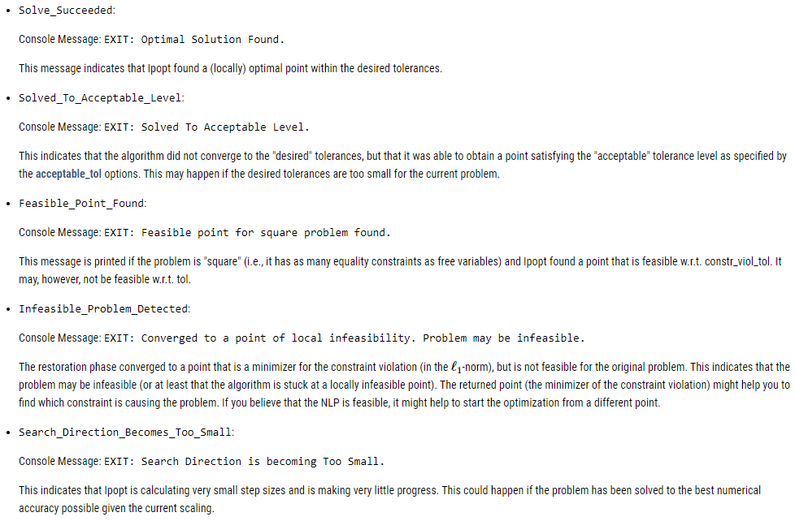
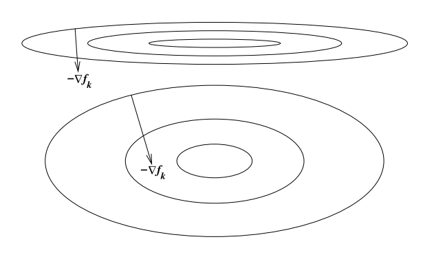

## Course Roadmap {background-color="orange"}


1.  [Introduction to Scientific Computing]{.gray}
2.  [Fundamentals of numerical methods]{.gray}
3.  [Systems of equations]{.gray}
4.  Optimization
    1. [Unconstrained optimization: intro]{.gray}
    2. [Unconstrained optimization: line search and trust region methods]{.gray}
    3. [Constrained optimization: theory and methods]{.gray}
    4. **Constrained optimization: modeling framework**
5.  Function approximation
6.  Structural estimation

## Agenda {background-color="orange"}

- In this lecture, we will learn how to model constrained optimization problems with a modeling framework
- Modeling frameworks are packages that allow us to write code that is closer to mathematical expressions and automate a lot of the solution steps for us

## Main references for today {background-color="orange"}

-   Miranda & Fackler (2002), Ch. 4
-   Judd (1998), Ch. 4
-   Nocedal & Writght (2006), Chs. 12, 15, 17--19
-   [JuMP documentation](https://jump.dev/)


# Constrained optimization in Julia


## Constrained optimization in Julia


::: {.columns}
::: {.column}
We are going to cover a cool package called `JuMP.jl`

- It offers a whole modeling language inside Julia
- You define your model and plug it into one of the [many solvers available](https://jump.dev/JuMP.jl/stable/installation/#Supported-solvers)
- It's like GAMS and AMPL... *but FREE and with a full-fledged programming language around it*
:::
::: {.column}

:::
:::


## Constrained optimization in Julia

Most solvers can be accessed directly in their own packages

- Like we did to use `Optim.jl`
- These packages are usually just a Julia interface for a solver programmed in another language

. . .

But `JuMP` gives us a unified way of specifying our models and switching between solvers

- `JuMP` is specifically designed for constrained optimization but works with unconstrained too 
  - With more overhead relative to using `Optim` or `NLopt` directly
- `JuMP` also [solves MCPs](https://jump.dev/JuMP.jl/stable/tutorials/nonlinear/complementarity/) in a much more user-friendly way than working directly with `NLSolve.jl`
  - And supports a more powerful solver: PATH (see [documentation](https://jump.dev/JuMP.jl/stable/packages/PATHSolver/))


## Getting stated with JuMP

There are 5 key steps:

1) Initialize your model and solver: 

```
mymodel = Model(SomeOptimizer)
```

. . .

2) Declare variables (adding any box constraints)

```
@variable(mymodel, x >= 0)
```

. . .

3) Declare the objective function

```
@objective(mymodel, Min, 12x^0.7 + 20y^2)
```


## Getting stated with JuMP

4) Declare constraints

```
@constraint(mymodel, c1, 6x^2 - 2y >= 100)
```

. . .

5) Solve it

```
optimize!(mymodel)
```

- Note the `!`, so we are modifying `mymodel` and saving results in this object


## Follow along!

Let's use `JuMP` to solve the illustrative problem from the first slides

We will use solver `Ipopt`, which stands for *Interior Point Optimizer*. It's a free solver we can access through package `Ipopt.jl`

```{julia}
using JuMP, Ipopt;
```


## Follow along: function definition

Define the function:
$$
\min_x -exp\left(-(x_1 x_2 - 1.5)^2 - (x_2 - 1.5)^2 \right)
$$

```{julia}
f(x_1,x_2) = -exp(-(x_1*x_2 - 3/2)^2 - (x_2-3/2)^2);
```


## Follow along: initialize model


Initialize the model for `Ipopt`

```{julia}
my_first_model = Model(Ipopt.Optimizer)
```

. . .

You can set optimzer parameters like this (there are TONS of parameters you can adjust (see the [manual](https://coin-or.github.io/Ipopt/OPTIONS.html))

```{julia}
# This is relative tol. Default is 1e-8
set_optimizer_attribute(my_first_model, "tol", 1e-9) 
```


## Follow along: declare variables

We will focus on non-negative values 

```{julia}
#| output: true
@variable(my_first_model, x_1 >=0)
```

```{julia}
#| output: true
@variable(my_first_model, x_2 >=0)
```

- You could type `@variable(my_model, x_1)` to declare a $x_1$ as a free variable
- If you want to define the initial guess for the variable, you can do it with the `start` argument like this

```
@variable(my_first_model, x_1 >=0, start = 0)
```


## Follow along: declare objective

```{julia}
@objective(my_first_model, Min, f(x_1,x_2))
```

. . .

`JuMP` will use autodiff (with `ForwardDiff` package) by default. If you want to use your define gradient and Hessian, you need to "register" the function like this

```
register(my_first_model, :my_f, n, f, grad, hessian)
```

- `:my_f` is the name you want to use inside `model`, `n` is the number of variables `f` takes, and `grad` `hessian` are user-defined functions


## Follow along: solving the model

First, let's solve the (mostly) unconstrained problem

- Not really unconstrained because we defined non-negative `x_1` and `x_2` 

Checking our model
```{julia}
print(my_first_model)
```


## Follow along: solving the model

```{julia}
optimize!(my_first_model)
```


## Follow along: solving the model

The return message is rather long and contains many details about the execution. You can turn this message off with

```{julia}
set_silent(my_first_model);
```

We can check minimizers with

```{julia}
#|include: false
optimize!(my_first_model);
```

```{julia}
unc_x_1 = value(x_1)
```
```{julia}
unc_x_2 = value(x_2)
```


## Follow along: solving the model


And the minimum with

```{julia}
unc_obj = objective_value(my_first_model)
```


## Follow along: solving the model




## Follow along: declaring constraints

Let's create a new model that now adds a nonlinear equality constraint $x_1 = x_2^2$

- Note that, for this solution to work, I needed to specify reasonable initial guesses with `start`. If we don't do it, the solution will converge to another local minimum that is incorrect.

```{julia}
#| output: asis
my_model_eqcon = Model(Ipopt.Optimizer);
@variable(my_model_eqcon, x_1 >=0, start = 1.0);
@variable(my_model_eqcon, x_2 >=0, start = 1.0);
@objective(my_model_eqcon, Min, f(x_1, x_2));
@constraint(my_model_eqcon, -x_1 + x_2^2 == 0);
```
```{julia}
#| output: asis
print(my_model_eqcon)
```

## Follow along: declaring constraints

Now let's solve it

```{julia}
optimize!(my_model_eqcon)
```


## Follow along: solving the equality constrained model


```{julia}
eqcon_x_1 = value(x_1)
```
```{julia}
eqcon_x_2 = value(x_2)
```
```{julia}
value(-x_1 + x_2^2) # We can evaluate expressions too
```
```{julia}
eqcon_obj = objective_value(my_model_eqcon)
```


## Follow along: solving the equality constrained model




## Solving the inequality constrained model

Next, let's now initialize a new model with inequality constraint $-x_1 + x^2 \leq 0$

```{julia}
my_model_ineqcon = Model(Ipopt.Optimizer);
@variable(my_model_ineqcon, x_1 >=0);
@variable(my_model_ineqcon, x_2 >=0);
@objective(my_model_ineqcon, Min, f(x_1, x_2));
@constraint(my_model_ineqcon, -x_1 + x_2^2 <= 0);
optimize!(my_model_ineqcon);
```


## Solving the inequality constrained model

```{julia}
ineqcon_x_1 = value(x_1)
```
```{julia}
ineqcon_x_2 = value(x_2)
```
```{julia}
ineqcon_obj = objective_value(my_model_ineqcon)
```

Same results as in the equality constraint: the constraint is binding


## Solving the inequality constrained model




## Relaxing the inequality constraint

What if instead we use inequality constraint $-x_1 + x^2 \leq 1.5$?

```{julia}
my_model_ineqcon_2 = Model(Ipopt.Optimizer);
@variable(my_model_ineqcon_2, x_1 >=0);
@variable(my_model_ineqcon_2, x_2 >=0);
@objective(my_model_ineqcon_2, Min, f(x_1, x_2));
@constraint(my_model_ineqcon_2, c1, -x_1 + x_2^2 <= 1.5);
optimize!(my_model_ineqcon_2);
```


## Relaxing the inequality constraint

```{julia}
ineqcon2_obj = objective_value(my_model_ineqcon_2)
```
```{julia}
ineqcon2_x_1 = value(x_1)
```
```{julia}
ineqcon2_x_2 = value(x_2)
```

We get the same results as in the unconstrained case


## Solving the inequality constrained model




# Practical advice for numerical optimization


## Best practices for optimization

Plug in your guess, let the solver go, and you're done right?

. . .

[**WRONG!**]{.red}

. . .

These algorithms are not guaranteed to always find even a local solution, you need to test and make sure you are converging correctly


## Check return codes

Return codes (or exit flags) tell you why the solver stopped

- There are all sorts of reasons why a solver ends execution
- Each solver has its own way of reporting errors
- In `JuMP` you can use `@show termination_status(mymodel)`

[**READ THE SOLVER DOCUMENTATION!**]{.red}

. . .

Use trace options to get a sense of what went wrong

- Did guesses grow unexpectedly?
- Did a gradient-based operation fail? (E.g., division by zero)


## Check return codes

Examples from [Ipopt.jl documentation](https://coin-or.github.io/Ipopt/OUTPUT.html)




## Try alternative algorithms

Optimization is approximately 53% art

. . .

Not all algorithms are suited for every problem $\rightarrow$ it is useful to check how different algorithms perform

. . .

Interior-point is usually the default in constrained optimization solvers (low memory usage, fast), but try other algorithms and see if the solution generally remains the same


## Problem scaling

The **scaling** of a problem matters for optimization performance

. . .

A problem is **poorly scaled** if changes to $x$ in a certain direction
produce much bigger changes in $f$ than changes to in $x$ in another direction

. . .




## Problem scaling

Ex: $f(x) = 10^9 x_1^2 + x_2^2$ is poorly scaled

. . .

This happens when things change at different rates:

- Investment rates are between 0 and 1
- Consumption can be in trillions of dollars

. . .

How do we solve this issue?

. . .

Rescale the problem: put them in units that are generally within an order of magnitude of 1

- Investment rate in percentage terms: $0\%-100\%$
- Consumption in units of trillion dollars instead of dollars


## Be aware of tolerances

Two main tolerances in optimization:

1. `ftol` is the tolerance for the change in the function value (absolute and relative)
2. `xtol` is the tolerance for the change in the input values (absolute and relative)

. . .

What is a suitable tolerance?


## Be aware of tolerances

It depends

. . .

Explore sensitivity to tolerance, typically pick a conservative (small) number

- Defaults in solvers are usually `1e-6`

If you are using simulation-based estimators or estimators that depend on successive optimizations, be even more conservative *because errors compound*


## Be aware of tolerances

May be a substantial trade-off between accuracy of your solution and speed

. . .

Common bad practice is to pick a larger tolerance (e.g. `1e-3`) so the problem "works" (e.g. so your big MLE converges)

. . .

Issue is that `1e-3` might be pretty big for your problem if you haven't checked that your solution is not sensitive to the tolerance


## Perturb your initial guesses

**Initial guesses matter**

. . .

Good ones can improve performance

- E.g. initial guess for next iteration of coefficient estimates should be current iteration estimates

. . .

Bad ones can give you terrible performance, or wrong answers if your problem isn't perfect

- E.g. bad scaling, not well-conditioned, multiple equilibria


