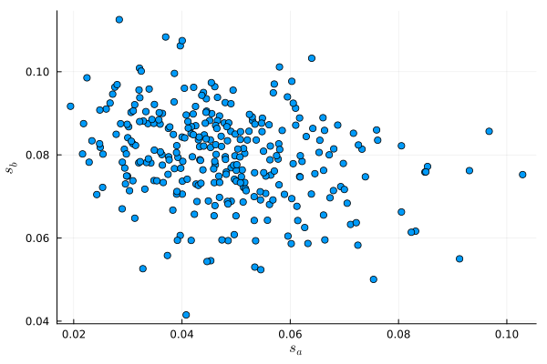
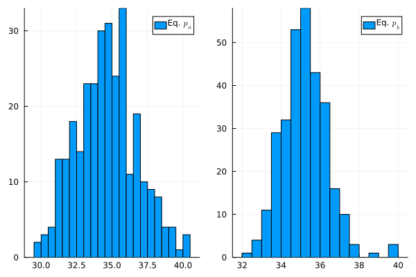
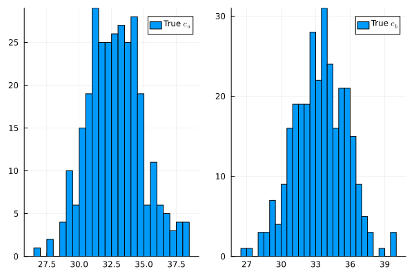

## Course Roadmap {background-color="orange"}


1.  [Introduction to Scientific Computing]{.gray}
2.  [Fundamentals of numerical methods]{.gray}
3.  [Systems of equations]{.gray}
4.  [Optimization]{.gray}
5.  [Function approximation (postponed)]{.gray}
6.  [Structural estimation: Intro]{.gray}
7.  **Generalized Method of Moments**
8.  Maximum Likelihood Estimator
9.  Simulation-based methods


## Main references for today {background-color="orange"}

- Theory: Cameron & Trivedi (2008), Greene (2018)


## Agenda {background-color="orange"}

- We will estimate demand and strategic supply models jointly using GMM
- Using estimated parameters, we will predict marginal costs
- Then, using marginal costs, we will quantify market power in this industry


# Introduction

## Setting: a duopoly of car models

- We will study a fictitious duopoly of two firms $A$ and $B$ that make competing car models.
- For simplicity, we will assume these are the only two products available in this market segment.

. . .

Research question: **How much market power do car brands A and B have?**

## Data

Research question: **How much market power do car brands A and B have?**

We have data from a random sample from $N=300$ local markets (indexed by $j$) for car models A and B

- Shares: $s_k$
- Prices: $p_k$
- Local steel prices: $t_j$
- Average local labor costs: $l_j$
  
To assess market power, we want to estimate the mean Lerner index for each firm
$$
L_k = \frac{1}{N} \sum_{j=1}^N \frac{p_{k,j} - c_{k,j}}{p_{k,j}}
$$

# Theoretical and statistical models

## Demand: theoretical model

In a given market, consumers have 3 options: 

- Buy one car of model a with price $p_a$
- Buy one car of model b with price $p_b$
- Not to buy a car, i.e., the outside option

If consumer $i$ buys car $k$, they get utility

$$u_{i,k} = \beta_0 -\alpha p_k + \beta_1 B^D_k + \beta_2 \xi^D_k + \nu_{ik} \equiv V_k + \nu_{ik}$$

where 

- $\alpha$ and $\beta$ are model parameters
- $B^D_k$ is a vector of **observed** product characteristics that consumers care about
- $\xi^D_k$ is a vector of **unobserved** product characteristics that consumers care about
- $\nu_{ik}$ is the (mean zero) idiosyncratic taste of consumer $i$ for product $k$
- $V_{k}$ is the mean utility for product $k$

If they do not buy a car, they get zero utility. Consumers are utility maximizers, so they pick the option that yields the highest utility.

## Demand: theoretical model

Assuming $\nu_{ik}$ is distributed in the population following a Type I Extreme Value distribution, we can derive a closed-form expression for expected market shares of products $a$ and $b$. This will give us the classic Logit model (we will see the details of this in the next unit)

$$
\begin{align}
s_{a}=& \Pr(\text{Buying A})=\frac{e^{V_a}}{1+e^{V_a}+e^{V_b}} \\
s_{b}=& \Pr(\text{Buying B})=\frac{e^{V_b}}{1+e^{V_a}+e^{V_b}}
\end{align}
$$

The demand for the outside option is given by $s_0 = 1 - s_A - s_B = \frac{1}{1+e^{V_a}+e^{V_b}}$

## Demand: theoretical model

**Useful trick**. Note that $\frac{s_k}{s_0} = e^{V_k}$. Take logs on both sides:
$$
\log(s_k)-\log(s_0) = V_k = \beta_0  -\alpha p_k + \beta_1 B^D_k + \beta_2 \xi^D_k
$$

This expression gives us a linear equation that, in principle, we could estimate with OLS!

- This is what researchers do typically when they only have aggregate data (shares rather than individual decisions)

## Demand: statistical model

$$
\log(s_k)-\log(s_0) = \beta_0  -\alpha p_k + \beta_1 B^D_k + \beta_2 \xi^D_k
$$


But the expression above refers to expected shares and does not fit the data exactly. For this reason, we add an idiosyncratic demand shock $\epsilon^D_{k,j}$ to obtain 

$$
\log(s_{k,j})-\log(s_{0,j}) = V_{k,j} + \epsilon_{k,j} = \beta_0 -\alpha p_{k,j} + \beta_1 B^D_{k,j} + \beta_2 \xi^D_{k,j} + \epsilon^D_{k,j}
$$

We assume $\epsilon^D_{k,j}$ has mean zero and is uncorrelated with $p_{k,j}$, $B^D_{k,j}$, and $\xi^D_{k,j}$

## Supply: theoretical model

Since this market is a duopoly, firms anticipate that their pricing decisions affect their demands mutually

- Firms then choose the price that maximizes their expected profits given the price their competitor has chosen: Bertrand competition

We assume that the outcome of this process is a Nash equilibrium: firms do the best they can given what others are doing and no firm has an incentive to unilaterally deviate

- Hence, each market is in a Nash-Bertrand equilibrium

## Supply: theoretical model

Let $c_{k}$ be the constant marginal cost. Then in each market each firm solves:
$$
\max_{p_{k}} \pi(p_k, p_{-k}) = p_{k} s_k(p_k, p_{-k}) - c_{k} s_k(p_k, p_{-k})
$$  

The first-order condition is

$$
\partial\pi_k/\partial p_k = 0 \Rightarrow s_k(p_k, p_{-k}) + (p_k - c_k) \frac{\partial s_k(p_k, p_{-k})}{\partial p_k} = 0
$$


## Supply: theoretical model

Using the closed-form expression for the derivative $\frac{\partial s_k(p_k, p_{-k})}{\partial p_k} = -\alpha s_k (1-s_k)$, it follows that
$$
\begin{align}
s_k - \alpha(p_k - c_k)s_k(1-s_k) = 0\\
c_k = p_k - \frac{1}{\alpha(1-s_k)}
\end{align}
$$

Thus, given a value of parameter $\alpha$, we can calculate marginal costs that rationalize equilibrium prices and shares

## Supply: statistical model

With parameter estimate $\hat{\alpha}$ and using the expression for rationalized marginal costs based on the FOC, we can write predict expected marginal costs
$$
\hat{c}_{k,j} = p_{k,j} - \frac{1}{\hat{\alpha}(1-s_{k,j})}
$$

## Supply: statistical model

We parameterize marginal cost using observable input costs and add an idiosyncratic cost shock $\epsilon^S_{k,j}$ to accomodate for differences from the expectation

$$
\hat{c}_{k,j} = \gamma_0 + \gamma_1 B^S_{k,j} + \gamma_2 t_{j} + \gamma_3 l_{j} + \gamma_4 \xi^S_k +\epsilon^S_{k,j}
$$

where

- $\gamma$ are parameters to be estimated
- $t_{j}$ and $l_{j}$ are local input costs for steel and labor
- $B^S_k$ is a vector of **observed** product characteristics that affect costs
- $\xi^S_k$ is a vector of **unobserved** product characteristics that affect costs

We assume $\epsilon^S_{k,j}$ to be uncorrelated with $t_{j}$, $l_{j}$, $B^S_{k,j}$, and $\xi^S_k$


# Estimation

## Estimation: demand moment conditions

$$
\log(s_{k,j})-\log(s_{0,j}) = \beta_0 -\alpha p_{k,j} + \beta_1 B^D_{k,j} + \beta_2 \xi^D_{k,j} + \epsilon^D_{k,j}
$$

Do we have a problem to estimate this equation?

. . .

Very likely, YES! Unobserved product characteristics affect willingness to pay: $E[p_{k,j}\xi^D_{k,j}] \neq 0$

Since we can't include $\xi^D_{k,j}$, we have that $E[p_{k,j}(\beta_2 \xi^D_{k,j} + \epsilon^D_{k,j})] \neq 0 \Rightarrow$ **ENDOGENEITY!**

How can we solve this?

. . .

**With instruments**

- We can use input costs $t_{j}, l_{j}$ to instrument for price
- Key idea: with fixed product characteristics, higher costs lead to higher prices without affecting demand^[In the script to generate this data, products have an omitted quality index that affects both utility and costs.]

## Estimation: demand moment conditions

So, we rewrite the demand estimating equation as

$$
\log(s_{k,j})-\log(s_{0,j}) = \beta_0 -\alpha p_{k,j} + \beta_1 B^D_{k,j} + \epsilon^D_{k,j} = X^D_{k,j} \theta^D + \epsilon^D_{k,j}
$$

where 

- $\theta^D$ is the parameter column vector $[\beta_0 \; -\alpha \; \beta_1]^\prime$
- $X^D$ is the row vector $[1 \; p_{k,j} \; B^D_{k,j}]$, with $B^D_{k,j}$ being a dummy variable receiving 1 for product b ($k=b$) or 0 otherwise
    - $B^D_{k,j}$ will pick up all the perceived product characteristics that are constant across markets


## Estimation: demand moment conditions

Denote the instrument vector $Z_{k,j} = [1 \; B^D_{k,j} \; t_{j} \; l_{j} ]$. Then, we can form moment conditions
$$
E\left[Z^\prime_{k,j}\epsilon^D_{k,j}\right] = 0
$$

Q: How many moment conditions do we have here?

## Estimation: demand moment conditions

A: We have **four moment** conditions from the demand side

$$
\begin{align}
E\left[\epsilon^D_{k,j}\right] & = 0\\
E\left[B^D_{k,j}\epsilon^D_{k,j}\right] & = 0\\
E\left[t_{j}\epsilon^D_{k,j}\right] & = 0\\
E\left[l_{j}\epsilon^D_{k,j}\right] & = 0
\end{align}
$$

## Estimation: supply moment conditions

$$
\hat{c}_{k,j} = \gamma_0 + \gamma_1 B^S_{k,j} + \gamma_2 t_{j} + \gamma_3 l_{j} + \gamma_4 \xi^S_k +\epsilon^S_{k,j}
$$

Again, we have unobserved characteristics that affect cost. However, endogeneity is less of a concern here if we consider this sector to be a small part of the economy:

- Prices for steel and labor clear on much bigger markets, thus decisions of product characteristics are unlikely to affect their prices

For this reason, we can more reasonably assume that $E[t_{j}\epsilon^S_{k,j}]=0$, $E[l_{j}\epsilon^S_{k,j}]=0$, and $E[B^S_{k,j}\epsilon^S_{k,j}]=0$

## Estimation: supply moment conditions

So we rewrite our supply estimating equation as

$$
\hat{c}_{k,j} = \gamma_0 + \gamma_1 B^S_{k,j} + \gamma_2 t_{j} + \gamma_3 l_{j} + \epsilon^S_{k,j} = \theta^S X^S_{k,j} + \epsilon^S_{k,j}
$$

where 

- $\theta^S$ is the parameter column vector $[\gamma_0 \; \gamma_1 \; \gamma_2 \; \gamma_3]^\prime$
- $X^S$ is the row vector $[1 \; B^S_{k,j} \;t_{j} \;l_{j}]$, with $B^S_{k,j}$ being a dummy variable receiving 1 for product b ($k=b$) or 0 otherwise

Since $X^S$ are instruments for themselves (and note that $X^S_{k,j} = Z_{k,j}$, we can construct supply moment conditions

$$
E\left[Z^\prime_{k,j}\epsilon^S_{k,j}\right] = 0
$$

Q: How many moment conditions do we have here?

## Estimation: demand moment conditions

A: Again, we have **four moment** conditions, now from the supply side
$$
\begin{align}
E\left[\epsilon^S_{k,j}\right] & = 0\\
E\left[B^S_{k,j}\epsilon^S_{k,j}\right] & = 0\\
E\left[t_{j}\epsilon^S_{k,j}\right] & = 0\\
E\left[l_{j}\epsilon^S_{k,j}\right] & = 0
\end{align}
$$

# Data Generation

Let's stop here to check out the data generating script.


## Data Generation: quantities

Distribution of shares across markets



## Data Generation: prices

Distribution of equilibrium prices across markets



# Programming the estimation

## Time for some actual estimation

Let's work! The data for this exercise are in file `duopoly_shares_data.csv`.

Our empirical plan is:

1. Using these 8 moment conditions, joinly estimate parameter vector $\theta = [\theta^D, \theta^S]$ with GMM
2. Using our estimate $\hat{\alpha}$, predict marginal costs (equation 2) and calculate the average Lerner index for each car model: $\hat{L}_k = \frac{1}{N} \sum_{j=1}^N \frac{p_{k,j} - \hat{c}_{k,j}}{p_{k,j}}$

## Loading and preparing the data

```{julia}
using DataFrames, CSV
df = CSV.read("duopoly_shares_data.csv", DataFrame);
df[1:4, :] # First few rows
```


## Loading and preparing the data

This data set already includes $s_0$ calculated for you. Let's get $N$ and generate

- $log(s_{k,j}) - log(s_{0,j})$
- $B_{k,j}$

```{julia}
N = nrow(df); # Get number of rows
df.logsk_logs0 = log.(df.s_k) - log.(df.s_0); # Calculate LHS of demand equation
df.is_B = (df.product .== "b"); # Create dummy variable for product B
df[1:4,:]  # Check first rows
```


## Loading and preparing the data

It might also be useful to prepare matrices $X$ and $Z$

```{julia}
X = [ones(N) df.p_k df.is_B];
Z = [ones(N) df.is_B df.steel df.labor];
```


## Moment conditions function

Next, we program function `g_i(θ)` that receives parameter vector $\theta$ and returns the eight moment conditions for all observations ($N \times 8$ matrix). Here is a way to structure it

```{julia}
function g_i(θ)
    # DEMAND SIDE
    θ_d = θ[1:3] # Demand parameters
    # Epsilons for demand side
    ϵ_d = df.logsk_logs0 - (X * θ_d) 
    # Moment conditions for demand side
    m_di = Z .* ϵ_d

    # SUPPLY SIDE
    # Calculate implied costs
    α = -θ[2] # We need it to recover costs
    c_k = df.p_k - 1/α .* 1 ./(1 .- df.s_k)

    θ_s = θ[4:7] # Supply parameters
    # Epsilons for supply side
    ϵ_s = c_k - (Z * θ_s)
    # Moment conditions for supply side
    m_si = Z .* ϵ_s
  
    # Return matrices side by side (N x M)
    return([m_di m_si])
end;
```


## Moment conditions function

Then, we program `g_N(θ)` to calculate the sample analogue: $g_N(\theta) = \frac{1}{N} \sum_{i=1}^N g(y_i, x_i;\theta)$

```{julia}
function g_N(θ)
  # Get moment vectors
  g_is = g_i(θ)
  # Take means of each column and return
  return [sum(g_is[:, k]) for k in 1:M] ./ N
end;
```

## GMM estimation

With function `g_i(θ)`, we can use `Optim` package to minimize objective function `Q(θ)` 

```{julia}
using LinearAlgebra
M = 8 # Eight moment conditions
W_0 = I(M) # Identity Matrix
function Q(θ; W = W_0)
    # Get g_N
    m_i = g_i(θ)
    G = g_N(θ)
    # Calculate Q    
    G' * W * G
end;
```

## GMM estimation

- For the first step, use $W$ as the identity matrix and find estimate `θ_1`
- For the second step, $\hat{W}=(\hat{S})^{-1}$. So, you will need to calculate 

$$
\hat{S} = N^{-1}\sum_i g_i(\hat{\theta}_1) g_i(\hat{\theta}_1)^\prime
$$


## GMM estimation: initial guess

Given the dimensionality of the problem it's a good idea to start with a reasonable initial guess 

- Let's use OLS to get an initial guess for $\theta^D$. 
- For $\theta^S$, let's guess $\gamma_0$ as the minimum price and set 0.1 for the other parameters (we expect them to be positive)

```{julia}
using GLM
# OLS regression to get initial guess
ols_reg = lm(@formula(logsk_logs0 ~ 1 + p_k + is_B), df);
θ_0 = [coef(ols_reg); minimum(df.p_k); ones(3)./10];
θ_0'
```


## GMM estimation: first step

```{julia}
# Step 1
using Optim
res = Optim.optimize(Q, θ_0, Newton(), Optim.Options(f_abstol=1e-10))
θ_1 =  res.minimizer;
θ_1'
```

## GMM estimation: first step

Next, calculate $W = \hat{S}^{-1}$ where $\hat{S} = N^{-1}\sum_i g(\hat{\theta}_1) g(\hat{\theta}_1)^\prime$
```{julia}
# Calculate W_hat (note that g_i transposed gs)
W_1 = inv(g_i(θ_1)'  * g_i(θ_1) ./N)
```


## GMM estimation: second step

```{julia}
# Use step 1 estimates as initial guess
res = Optim.optimize(θ ->  Q(θ; W = W_1), θ_1, Newton(), Optim.Options(f_abstol=1e-10))
θ_GMM =  res.minimizer;
θ_GMM'
```


## GMM estimation: standard errors

The variance-covariance matrix of the GMM estimator is given by
$$
V(\hat{\theta}) = \frac{1}{N}(\hat{D}^\prime \hat{S}^{-1} \hat{D})^{-1}
$$

where:

- $\hat{D} =  \frac{\partial g_N(\hat{\theta})}{\partial \hat{\theta}^\prime}$
- $\hat{S} =  N^{-1}\sum_i g_i(\hat{\theta}) g_i(\hat{\theta})^\prime$

## GMM estimation: standard errors

We will use autodiff to calculate $\hat{D}$

$$
\hat{D} =  \frac{\partial g_N(\hat{\theta})}{\partial \hat{\theta}^\prime}
$$

```{julia}
using ForwardDiff
D_hat = ForwardDiff.jacobian(g_N, θ_GMM)
```

## GMM estimation: standard errors

Calculating $\hat{S}$

$$
\hat{S} =  N^{-1}\sum_i g_i(\hat{\theta}) g_i(\hat{\theta})^\prime
$$

```{julia}
# Again, note that function g_i transposed gs
S_hat = g_i(θ_GMM)'  * g_i(θ_GMM) ./N
```

## GMM estimation: standard errors

So, finally

$$
V(\hat{\theta}) = \frac{1}{N}(\hat{D}^\prime \hat{S}^{-1} \hat{D})^{-1}
$$

```{julia}
V_hat = inv(D_hat' * inv(S_hat) * D_hat) ./N
```

## GMM estimation: standard errors

So, the standard errors are the square root of the diagonal elements.

```{julia}
SEs = sqrt.(diag(V_hat))
```


## GMM estimation: standard errors

Then, we can organize the results in a table with 95% confidence intervals

```{julia}
using DataFrames, Distributions
results_df = DataFrame(
  Coefficient = ["β_0", "-α", "β_1", "γ_0", "γ_1", "γ_2", "γ_3"],
  Estimate = θ_GMM,
  StdError = SEs,
  CI_lower = θ_GMM .+ quantile(Normal(), 0.025) .* SEs,
  CI_upper = θ_GMM .+ quantile(Normal(), 0.975) .* SEs
)

println(results_df)
```


## Marginal cost estimation

Now that we have estimated all model parameters, we can pick $\alpha$ to calculate implied marginal costs

$$
\hat{c}_k = p_k - \frac{1}{\hat\alpha(1-s_k)}
$$

```{julia}
α_hat = -θ_GMM[2];
df.c_k = df.p_k - 1/α_hat .* 1 ./(1 .- df.s_k);
```

## Marginal cost estimation

Let's take a look at the distribution of costs per firm

```{julia}
using Plots, LaTeXStrings
plot(histogram(df.c_k[.!df.is_B], label=L"Pred. $c_a$", bins=30), histogram(df.c_k[df.is_B], label=L"Pred. $c_b$", bins=30))
```


## True marginal costs 

How does the distribution compare to the true marginal costs?



## Market power analysis

We are now ready to calculate the average Lerner index per firm

$$
L_k = \frac{1}{N} \sum_{j=1}^N \frac{p_{k,j} - c_{k,j}}{p_{k,j}}
$$

```{julia}
df.lerner_k = (df.p_k - df.c_k) ./ df.p_k;
# Firm A
mean_lerner_a = sum(df.lerner_k[.!df.is_B])./(N/2);
# Firm B
mean_lerner_b = sum(df.lerner_k[df.is_B])./(N/2);
println("The mean Lerner index of firm A is $(round(mean_lerner_a, digits=4)) and for firm B is $(round(mean_lerner_b, digits=4))")
```

So about 24% of the price is due to market power.

- Firm B has slightly higher market power due to its perceived higher quality ($\beta_1 = 0.63 > 0$)
  - All else equal, what is the WTP to have model B over model A?

