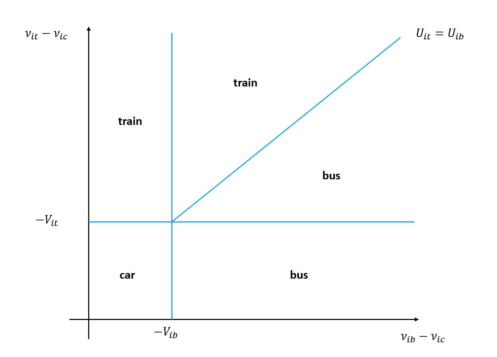

## Course Roadmap {background-color="orange"}


1.  [Introduction to Scientific Computing]{.gray}
2.  [Fundamentals of numerical methods]{.gray}
3.  [Systems of equations]{.gray}
4.  [Optimization]{.gray}
5.  [Function approximation (postponed)]{.gray}
6.  [Structural estimation: Intro]{.gray}
7.  [Generalized Method of Moments]{.gray}
8.  **Maximum Likelihood Estimator**
9.  Simulation-based methods


## Main references for today {background-color="orange"}

- The examples in this lecture are adapted from "Learning Microeconometrics with R", by Christopher P. Adams (2021)
- Theory: Cameron & Trivedi (2008), Greene (2018)

# Introduction

## Demand for a new rail system

- Inspired by McFadden's study of the BART system, we will simulate a similar setting to estimate the value of expanding the public transit system in a city with limited service
- We will assume residents have three main transportation modes for commuting: bus (b), car (c), or train (t)
- We will also assume these choices represent the mode most used, so they are mutually exclusive choices
- We start by writting down the random utility model to capture the discrete choices individuals make

## Random Utility Model

The utility individual $i$ obtains from chosing a mode $k \in \{b, c, t\}$ as their main transportation mode is given by

$$
\begin{align}
U_{ib} = X_{ib}^\prime \beta_b + \nu_{ib} = V_{ib} + \nu_{ib} \\
U_{ic} = X_{ic}^\prime \beta_c + \nu_{ic} = V_{ic} + \nu_{ic} \\
U_{it} = X_{it}^\prime \beta_t + \nu_{it} = V_{it} + \nu_{it} 
\end{align}
$$

Where $X$, $\beta$ and $\nu$ are defined as in the previous lecture. Here, $V_{ik}$ represents the average utility of an individual with the same observed characteristics as $i$ when choosing option $k$.

Note that each choice has its own $\beta$, so we are modeling a Multinomial case with choice-specific parameters. This is a common approach in the discrete choice literature, but it is not the only one. We could also have a model with generic parameters, where the same $\beta$ applies to all choices, and the differences in utility come from the observed characteristics $X_{ik}$.

---

Therefore, if an individual $i$ chooses train, by the revealed preference assumption we have that

$$
U_{it} > U_{ib} \Rightarrow \nu_{it} - \nu_{ib} > -\left(V_{it} - V_{ib} \right) 
$$

and
$$
U_{it} > U_{ic} \Rightarrow \nu_{it} - \nu_{ic} > -\left(V_{it} - V_{ic} \right) 
$$


---

In this model, we will normalize utility by picking car to be the outside option and setting $\beta_c = 0$ (so $V_{ic} = 0$). We also define $\epsilon_{it} \equiv \nu_{it} - \nu_{ic}$ and $\epsilon_{ib} \equiv \nu_{ib} - \nu_{ic}$

Therefore, the conditions for choosing train can be rewritten as

$$
\begin{align}
\epsilon_{it} & > -V_{it} \quad \text{ and} \\
\epsilon_{it} - \epsilon_{ib} & > -\left(V_{it} - V_{ib} \right)
\end{align}
$$

And for choosing bus as

$$
\begin{align}
\epsilon_{ib} & > -V_{ib} \quad \text{ and} \\
\epsilon_{ib} - \epsilon_{it} & > -\left(V_{ib} - V_{it} \right)
\end{align}
$$

---

We can represent these conditions in a diagram as follows




---

We assume the following observed characteristics affect the utility of each choice

- `price`: annual cost for a commuter in this modality (hundreds of dollars/year)
- `stops`: number of bus or train stops serving the city (count)
- `density`: population density of the city (thousands of people/sq. mile)
- `hhsize`: the household size (number of people)
- `homeown`: whether the individual is a home owner (0 or 1)

---


|Parameter  | Covariate   | Bus ($\beta_b$) | Train ($\beta_{t}$) |  
|:----------|:------------|:----------------:|:-------------------:|
| $\beta_0$ | Intercept   | -1.0 | -0.6 |
| $\beta_1$ | `price`     | -0.8 | -0.8 |
| $\beta_2$ | `stops`     |  0.1 |  0.2 |
| $\beta_3$ | `density`   |  0.3 |  0.6 |
| $\beta_4$ | `hhsize`    | -0.2 | -0.1 |
| $\beta_5$ | `homeown`   | -0.3 | -0.2 |

```{julia}
β_b = [-1.0, -0.8,  0.1,  0.3, -0.2, -0.3];
β_t = [-0.6, -0.8,  0.2,  0.6, -0.1, -0.2]; 
```

# Data generation: non-rail cities

## Survey assumptions

We are now ready to start generating the data that simulates this true model. We will first generate data to simulate surveys in 30 cities that currently do not have a rail system.

```{julia}
N_survey = 2000 # Individuals surveyed per city
N_nr_cities = 30 # Non-rail cities surveyed
```

## Bus systems

We start by simulating the characteristics of the transit system. First, we randomly generate the population densities of each city


```{julia}
using Random, Distributions, Statistics
Random.seed!(592)
density_nr = rand(Uniform(1, 8), N_nr_cities); # Thousands of people per square mile
```

We will assume that the number of bus stops is correlated with the density of the city and given by

```{julia}
busstops_nr = 5 .+ density_nr .* 6 .+ rand(Uniform(-3, 3), N_nr_cities) # 5 + 6 x density plus random variation
busstops_nr = round.(busstops_nr, digits = 0); # Make it an integer
```

Finally, we will also assume that the price is a function of the number of bus stops

```{julia}
price_nr = 100 .+ busstops_nr .* 15 .+ rand(Uniform(-50, 50), N_nr_cities); # 100 + 15 x stops plus random variation
price_nr = price_nr ./ 100; # Re-scale to hundreds of dollars
```

---

We can now assemble a data frame with the data for these cities

```{julia}
using DataFrames
cities_nr = DataFrame(
  city = ["nr_$(i)" for i in 1:N_nr_cities], # Create an index
  price_bus = price_nr,
  stops_bus = busstops_nr, 
  price_train = zeros(N_nr_cities), # No trains
  stops_train = zeros(N_nr_cities), # No trains
  density = density_nr
);
println(cities_nr[1:5,:]) # Look at first 5 rows
```


## Synthetic individuals

We will assume individuals have 75% probability of being homeowners in all non-rail cities

```{julia}
homeown_nr = rand(Bernoulli(0.75), N_survey * N_nr_cities);
```

We will assume household size is uncorrelated with being a homeowner or any city characteristics. Household size will be a minimum of 1 plus a random term that follows a Poisson distribution with $\lambda = 2.0$ (the mean of this distribution)

```{julia}
hhsize_nr = 1 .+ rand(Poisson(2.0), N_survey * N_nr_cities);
```

---

We can now assemble the survey data frame for these surveys. First, for individuals

```{julia}
survey_nr = DataFrame(
  city = repeat(["nr_$(i)" for i in 1:N_nr_cities], N_survey), # Create an index
  hhsize = hhsize_nr,
  homeown = homeown_nr
);
```

---

Now, merge with city characteristics


```{julia}
data_nr = leftjoin(survey_nr, cities_nr, on = :city);
println(data_nr[1:10,:]) # Look at first 10 rows
```


## Mean utility

We can now calculate the mean utility terms $V_{ik}$ for each individual

```{julia}
data_nr.V_ib = zeros(nrow(data_nr)) # Initialize V_{ib}
for i in 1:nrow(data_nr)
  # Get the corresponding row
  data_row = data_nr[i, [:price_bus, :stops_bus, :density, :hhsize, :homeown]]
  # Turn it into a numerical vector (adding the constant 1 in the first element)
  X_i = vcat(1.0, Vector{Float64}(data_row))

  # Calculate and store
  data_nr.V_ib[i] = X_i' * β_b;

end
```

---

Let's examine the distribution of $V_{ib}$

```{julia}
using Plots, LaTeXStrings
histogram(data_nr.V_ib, xlabel=L"V_{ib}", label="")
```


## Idiosyncratic tastes

Next, we will simulate the idiosyncratic taste parameters $\epsilon_{it} \equiv \nu_{it} - \nu{ic}$ and $\epsilon_{ib} \equiv \nu_{ib} - \nu{ic}$.

Here, we will make a critical assumption: **these shocks will be uncorrelated**. This assumption is at the core of the simplicity of the multinomial logit model. 

This implies the **independence from irrelevant alternatives (IIA)** assumption. In other words, the ratio of the probabilities of chosing an alternative $k$ over another alternative $j$ does not depend on the characteristics of other alternatives.

This is a quite restrictive assumption, as it disregards the possibility that substitution is more likely towards similar options.

*Note: The multinomial logit model has extensions that accommodate richer substitution patterns, most notably the nested logit and the mixed logit models. However, these models are beyond what we can cover in this tutorial. Please see Greene (2018) Chapter 18 for a discussion of the issues with IIA and the extensions to relax this assumption.

---

We will assume that taste parameters $\nu_{ik}$ are distributed T1EV, which results in $\epsilon_{ik}$ being distributed with a Logistic distribution.

For teaching purposes, we will assume that the true underlying distribution of $\epsilon_{ik}$ has mean zero but scale parameter $\sigma = 0.8$

```{julia}
data_nr.ϵ_ib = rand(Logistic(0.0, 0.8), nrow(data_nr));
data_nr.ϵ_it = rand(Logistic(0.0, 0.8), nrow(data_nr));
```

We can inspect the resulting utility 

```{julia}
histogram(data_nr.V_ib .+ data_nr.ϵ_ib, xlabel=L"V_{ib} + \epsilon_{ib}", label="")
```

So, individuals choosing bus over car are the ones to the right of 0!

## Simulating choices

We are now ready to determine the choices each individual makes. We will use a binary indicator $d_{ib}$ that receives 1 if this individual chooses bus or 0 otherwise.

```{julia}
data_nr.d_ib = (data_nr.V_ib .+ data_nr.ϵ_ib .> 0.0); 
data_nr.d_it = zeros(nrow(data_nr)); # t is not available, so all zeros
```

So, in the data we generated, what proportion of individuals travel by bus?


```{julia}
sum(data_nr.d_ib)/nrow(data_nr)
```

About 9%.


## Simulating survey answers

We don't know exactly how people who don't have the option would respond to a question about whether they would use the train. Just for illustration, let's assume that individuals reason that the train would cost 10% more than the bus and be as good as increasing the number of bus stops by 40%.

We can calculate the proportion of individuals that say they would adopt the train given the option based on a hypothethical $V$

```{julia}
data_nr.V_it_hyp = zeros(nrow(data_nr)) # Initialize hypothetical V_{ib}
for i in 1:nrow(data_nr)
  # Get the corresponding row
  data_row = data_nr[i, [:price_bus, :stops_bus, :density, :hhsize, :homeown]]

# Turn it into a numerical vector (adding the constant 1 in the first element)
  X_i = vcat(1.0, Vector{Float64}(data_row))

  X_i[2] = 1.1 * X_i[2] # Increase in prices
  X_i[3] = 1.4 * X_i[3] # But with an increase in bus stops

  # Calculate and store
  data_nr.V_it_hyp[i] = X_i' * β_b;

end
```


---

Again, we can look at the distribution of hypothetical utility

```{julia}
histogram(data_nr.V_it_hyp .+ data_nr.ϵ_it, xlabel=L"V_{it}^{hyp} + \epsilon_{it}", label="")
```

---

So, under this hypothetical guess, we can see how many people would use the train. Remember that, in this case, to choose the train we need

$$
\begin{align}
\epsilon_{it} & > -V_{it} \quad \text{ and} \\
\epsilon_{it} - \epsilon_{ib} & > -\left(V_{it} - V_{ib} \right)
\end{align}
$$

```{julia}
data_nr.d_it_hyp = (data_nr.V_it_hyp .+ data_nr.ϵ_it .> 0.0) .& (data_nr.V_it_hyp .+ data_nr.ϵ_it .> data_nr.V_ib .+ data_nr.ϵ_ib); 
```

Operator `&` represents the logical AND operator.

```{julia}
sum(data_nr.d_it_hyp)/nrow(data_nr)
```

Resulting in about 21.5% of the people saying they'd use the train.

---

But how many would still use the bus? For choosing bus we need

$$
\begin{align}
\epsilon_{ib} & > -V_{ib} \quad \text{ and} \\
\epsilon_{ib} - \epsilon_{it} & > -\left(V_{ib} - V_{it} \right)
\end{align}
$$

```{julia}
data_nr.d_ib_hyp = (data_nr.V_ib .+ data_nr.ϵ_ib .> 0.0) .& (data_nr.V_ib .+ data_nr.ϵ_ib .> data_nr.V_it_hyp .+ data_nr.ϵ_it); 
```

```{julia}
sum(data_nr.d_ib_hyp)/nrow(data_nr)
```

So about 7.4%. This means few people would switch from bus to train, and most of the hypothetical new train riders are those switching from cars.

---

Estimating a model of discrete choice based only on the non-rail cities has not much use, as we never actually observe people choosing to use the train. (Remember we don't see the true parameters, only the observable characteristics and the outcome of choices.)

So, we will rely on survey data from cities with a rail system hoping to learn about the choices residents of those cities make. Then, we will use that information to project what would happen in cities without rail.

One important aspect here is that cities with rail may have different characteristics, so we cannot simply take the percentage of users of trains in those cities and impute that.

# Data generation: rail cities

## Rail cities

We will again assume that we can survey 30 cities with rails systems.

```{julia}
N_r_cities = 30;
```

We proceed with the data generation as before, but assume different distributions of the characteristics

```{julia}
density_r = rand(Uniform(4, 12), N_r_cities); # Thousands of people per square mile
```

We will maintain the same assumption on bus stops being related to density and price being related to the number of bus stops

```{julia}
busstops_r = 5 .+ density_r .* 6 .+ rand(Uniform(-3, 3), N_r_cities) # 5 + 6 x density plus random variation
busstops_r = round.(busstops_r, digits = 0); # Make it an integer

busprice_r = 100 .+ busstops_r .* 15 .+ rand(Uniform(-50, 50), N_r_cities); # 100 + 15 x stops plus random variation
busprice_r = busprice_r ./ 100; # Re-scale to hundreds of dollars
```

---

This time, we need to decide on the number of train stops and their price as well. 

```{julia}
trainstops_r = 3 .+ density_r .* 2 .+ rand(Uniform(0, 5), N_r_cities) 
trainstops_r = round.(trainstops_r, digits = 0); # Make it an integer

trainprice_r = busprice_r.*100 .+ trainstops_r .* 5 .+ rand(Uniform(0, 50), N_r_cities); # Should be more expensive than bus
trainprice_r = trainprice_r ./ 100; # Re-scale to hundreds of dollars
```


We then assemble a data frame for these cities

```{julia}
cities_r = DataFrame(
  city = ["r_$(i)" for i in 1:N_r_cities], # Create an index
  price_bus = price_nr,
  stops_bus = busstops_nr, 
  price_train = trainprice_r,
  stops_train = trainstops_r,
  density = density_nr
);
println(cities_r[1:5,:]) # Look at first 5 rows
```


## Synthetic individuals

We will assume individuals have 50% probability of being homeowners in all rail cities

```{julia}
homeown_r = rand(Bernoulli(0.50), N_survey * N_r_cities);
```

We will change the mean of the household size in rail cities to 2.5

```{julia}
hhsize_r = 1 .+ rand(Poisson(1.5), N_survey * N_r_cities);
```

---

We then assemble the survey data frame for these surveys.

```{julia}
survey_r = DataFrame(
  city = repeat(["r_$(i)" for i in 1:N_r_cities], N_survey), # Create an index
  hhsize = hhsize_r,
  homeown = homeown_r
);
```

---

Now, merge with city characteristics


```{julia}
data_r = leftjoin(survey_r, cities_r, on = :city);
println(data_r[1:10,:]) # Look at first 10 rows
```


## Mean utility

We then calculate the mean utility terms $V_{ik}$ for each individual

```{julia}
data_r.V_ib = zeros(nrow(data_r)) # Initialize V_{ib}
data_r.V_it = zeros(nrow(data_r)) # Initialize V_{ib}
for i in 1:nrow(data_r)
  # Get the corresponding row
  data_row_b = data_r[i, [:price_bus, :stops_bus, :density, :hhsize, :homeown]]
  # Turn it into a numerical vector (adding the constant 1 in the first element)
  X_ib = vcat(1.0, Vector{Float64}(data_row_b))
  # Calculate and store
  data_r.V_ib[i] = X_ib' * β_b;
  
  # Repeat for train
  data_row_t = data_r[i, [:price_train, :stops_train, :density, :hhsize, :homeown]]
  X_it = vcat(1.0, Vector{Float64}(data_row_t))
  # Calculate and store
  data_r.V_it[i] = X_it' * β_t;
end
```

---

Let's examine the distributions of $V_{ib}$ and $V_{it}$

```{julia}
histogram(data_r.V_ib, xlabel=L"V_{ib}", label="")
```

---

```{julia}
histogram(data_r.V_it, xlabel=L"V_{it}", label="")
```


## Idiosyncratic tastes

We repeat the same assumption on the distribution of tastes from non-rail cities.

```{julia}
data_r.ϵ_ib = rand(Logistic(0.0, 0.8), nrow(data_nr));
data_r.ϵ_it = rand(Logistic(0.0, 0.8), nrow(data_nr));
```

We can inspect the resulting utility 

```{julia}
histogram(data_r.V_ib .+ data_r.ϵ_ib, xlabel=L"V_{ib} + \epsilon_{ib}", label="")
```

---

```{julia}
histogram(data_r.V_it .+ data_r.ϵ_it, xlabel=L"V_{it} + \epsilon_{it}", label="")
```

## Simulating choices

Again, we use binary variables $d_{ib}$ and $d_{it}$ to indicate the choice made by each individual. However, we now have to test two conditions for each case. Remember, for train we need

$$
\begin{align}
\epsilon_{it} & > -V_{it} \quad \text{ and} \\
\epsilon_{it} - \epsilon_{ib} & > -\left(V_{it} - V_{ib} \right)
\end{align}
$$


```{julia}
data_r.d_it = (data_r.V_it .+ data_r.ϵ_it .> 0.0) .& (data_r.V_it .+ data_r.ϵ_it .> data_r.V_ib .+ data_r.ϵ_ib); 
```

Again, `&` represents the logical AND operator.

---

For choosing bus we need

$$
\begin{align}
\epsilon_{ib} & > -V_{ib} \quad \text{ and} \\
\epsilon_{ib} - \epsilon_{it} & > -\left(V_{ib} - V_{it} \right)
\end{align}
$$

```{julia}
data_r.d_ib = (data_r.V_ib .+ data_r.ϵ_ib .> 0.0) .& (data_r.V_ib .+ data_r.ϵ_ib .> data_r.V_it .+ data_r.ϵ_it); 
```

---

We can plot them against each other to identify the regions of choice (but note that $V_{ik}$ is different for each $i$, so the cutoff points to car in this diagram are the axes)

```{julia}
scatter(data_r.V_ib .+ data_r.ϵ_ib, data_r.V_it .+ data_r.ϵ_it, label="",
        xlabel=L"$V_{ib} + \epsilon_{ib}$", ylabel=L"$V_{it} + \epsilon_{it}$")
# Add thresholds
plot!([0.0, 5.0], [0.0, 5.0], label = "", linewidth=4, color="red") # Bus-train threshold (45 degree line)
plot!([0.0, 0.0], [0.0, -10.0], label = "", linewidth=4, color="red") # Bus-car threshold
plot!([0.0, -10.0], [0.0, 0.0], label = "", linewidth=4, color="red") # Train-car threshold

# Add anotations
annotate!(-7.5, 5, text("Train", color="red"))
annotate!(-7.5, -8, text("Car", color="red"))
annotate!(3, -8, text("Bus", color="red"))
```

---

So, in the data we generated, what proportion of individuals travel by bus and train?

```{julia}
sum(data_r.d_ib)/nrow(data_r)
```


```{julia}
sum(data_r.d_it)/nrow(data_r)
```

So, about 9.8% of the residents use the bus and 12.4% use the train.


# Exporting the data

Finally, we will export the data into a CSV format. In the next part of this tutorial, we will pretend we don't know the true parameters that generated this data and will estimate them.

First, we need to stack the dataframes. We can do that using `vcat`, but we must ensure both dataframes have the same columns.

```{julia}
stacked_data = vcat(
  data_nr[:,[:city, :price_bus, :price_train, :stops_bus, :stops_train, :density, :hhsize, :homeown, :d_ib, :d_it]],
  data_r[:,[:city, :price_bus, :price_train, :stops_bus, :stops_train, :density, :hhsize, :homeown, :d_ib, :d_it]]
);
println(stacked_data[1:10,:]) # Print first 10 rows
```

---

Next, let's enforce some realistic standards for the variable types. First, prices and density can have up to 2 decimal digits

```{julia}
stacked_data.price_bus = round.(stacked_data.price_bus, digits=2);
stacked_data.price_train = round.(stacked_data.price_train, digits=2);
stacked_data.density = round.(stacked_data.density, digits=2);
```

Second, enforce integer in count variables.

```{julia}
stacked_data.stops_bus = Int.(stacked_data.stops_bus);
stacked_data.stops_train = Int.(stacked_data.stops_train);
stacked_data.hhsize = Int.(stacked_data.hhsize);
```

Finally, binary variables need to be coded as 0 or 1 (also casting them as integers). 

```{julia}
stacked_data.homeown = Int.(stacked_data.homeown);
stacked_data.d_ib = Int.(stacked_data.d_ib);
stacked_data.d_it = Int.(stacked_data.d_it);
```

---

Let's check.

```{julia}
println(stacked_data[1:10,:]) # Print first 10 rows
```

Good!

---

We can now save it as a CSV file.
```{julia}
using CSV
CSV.write("./transportation_mode_survey.csv", stacked_data) # Save in current folder
```


## Up next

- In part b of this lecture, we will estimate the discrete choice parameters to perform economic analyses.
- We will use the coefficients estimated in rail cities to predict the percentages of each mode in the cities currently without a rail system.
- Then, we will estimate the willingness to pay for implementing and expanding systems.
- Finally, we will calculate the welfare of introducing a system in each city.